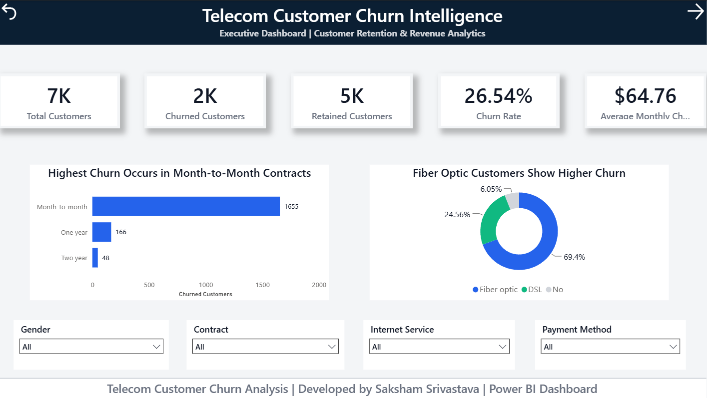
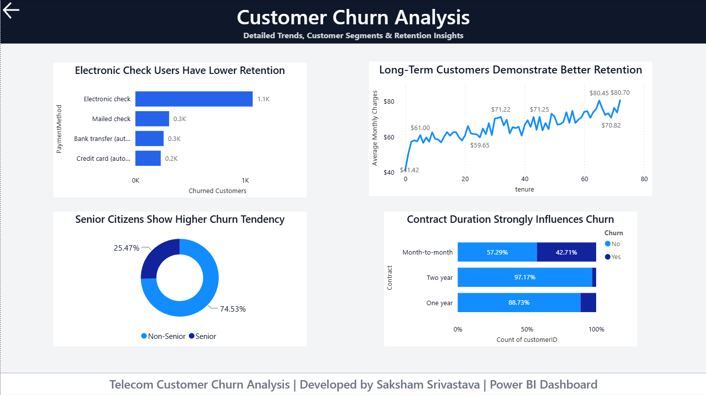

# 📊 Telecom Customer Churn Analysis | Python • SQL • Power BI

> **Turning customer data into actionable business insights using Python, SQL, and Power BI.**

## 👋 About This Project

Every subscription-based business faces a common challenge—**customer churn**. Losing existing customers not only reduces revenue but also increases the cost of acquiring new ones.

I built this project to explore customer behavior, identify the factors contributing to churn, and present meaningful insights through an interactive Power BI dashboard. The goal was not just to visualize data but to answer business questions that could help improve customer retention.

---

# 🎯 Project Objective

This project focuses on:

* Understanding customer churn patterns
* Identifying high-risk customer segments
* Measuring important business KPIs
* Building an interactive dashboard for business decision-making

---

# 🛠️ Tech Stack

| Tool                 | Purpose                           |
| -------------------- | --------------------------------- |
| **Python (Pandas)**  | Data cleaning & preprocessing     |
| **Jupyter Notebook** | Exploratory data analysis         |
| **SQL**              | Business queries & KPI analysis   |
| **Power BI**         | Interactive dashboard development |
| **DAX**              | Custom measures & calculations    |

---

# 📂 Project Workflow

```
Raw Dataset
      │
      ▼
Python Data Cleaning
      │
      ▼
SQL Analysis
      │
      ▼
Power BI Dashboard
      │
      ▼
Business Insights
```

---

# 📊 Dashboard Overview

The dashboard consists of two interactive pages.

### Executive Overview

* Total Customers
* Churned Customers
* Retained Customers
* Churn Rate
* Average Monthly Charges
* Interactive Filters

### Customer Churn Analysis

* Payment Method Analysis
* Contract-wise Churn
* Monthly Charges vs Tenure
* Senior Citizen Analysis

---

# 📈 Key Business Insights

After analyzing the dataset, several interesting patterns emerged:

* Customers with **Month-to-Month contracts** show the highest churn rate.
* **Fiber Optic** users are more likely to churn than customers using other internet services.
* Customers paying through **Electronic Check** demonstrate comparatively lower retention.
* Long-tenure customers tend to remain loyal.
* Senior citizens represent a significant share of churned customers.

These insights can help businesses design targeted retention strategies and improve customer lifetime value.

---

# 🧹 Data Preparation

The dataset was cleaned and transformed using Python before visualization.

The process included:

* Handling missing values
* Removing duplicate records
* Data validation
* Feature formatting
* Preparing a clean dataset for Power BI

---

# 🗄️ SQL Analysis

SQL was used to answer business-focused questions such as:

* Total customer count
* Churned vs retained customers
* Contract-wise distribution
* Payment method analysis
* KPI calculations
* Aggregated business insights

---

# 📸 Dashboard Preview

Dashboard screenshots are available in the **screenshots/** folder.

* Executive Overview
* Customer Churn Analysis

---

# 🚀 Skills Demonstrated

* Data Cleaning
* Exploratory Data Analysis
* SQL Query Writing
* DAX Measure Creation
* Power BI Dashboard Design
* Business Intelligence
* Data Visualization
* Interactive Reporting

---

# 📁 Project Structure

```
telecom-customer-churn-analysis/

├── dataset/
├── notebooks/
├── powerbi/
├── screenshots/
├── sql/
└── README.md
```

---

# 🌱 What I Learned

Working on this project helped me strengthen both technical and analytical skills.

Beyond creating charts, I learned how to:

* Convert raw data into business-ready information
* Design dashboards with a focus on usability
* Write SQL queries to answer real business questions
* Create meaningful KPIs using DAX
* Present insights in a way that supports decision-making

---

# 👨‍💻 About Me

**Saksham Srivastava**

Computer Science (Artificial Intelligence) Graduate

Aspiring Data Analyst passionate about transforming data into meaningful insights through Python, SQL, and Power BI.

---

⭐ *If you found this project interesting, feel free to explore the dashboard, notebook, and SQL analysis included in this repository.*

## 📸 Dashboard Preview

### Executive Overview



### Customer Churn Analysis


